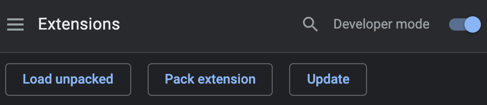

# 스포트라이트 크롬 익스텐션

## 설치

1. 레포를 다운로드합니다:

```bash
git clone https://github.com/datalater/spotlight.git
```
  
2. 크롬을 열고 URL에 다음 주소를 입력합니다: `chrome://extensions`
3. 오른쪽 상단에서 토글 스위치를 눌러 **개발자 모드**를 활성화 합니다.
4. `Load unpacked` 버튼을 누르고 확장 프로그램에 있는 디렉토리를 선택합니다.




## 사용법

1. 익스텐션 툴바 아이콘을 클릭합니다.
2. 크롬 개발자 도구를 열어 콘솔창에 `SPOTLIGHT ENABLED`가 찍혔는지 확인합니다.
3. 현재 페이지에서 `shift` 키를 누릅니다.
4. 스포트라이트 기능을 끄려면 페이지 새로고침을 합니다.

## 데모 영상


## See also

- [Chrome Developers - Getting started](https://developer.chrome.com/docs/extensions/mv3/getstarted/)


