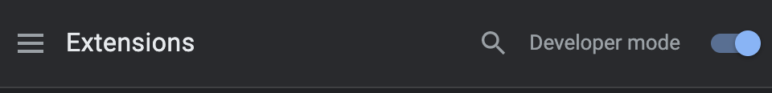
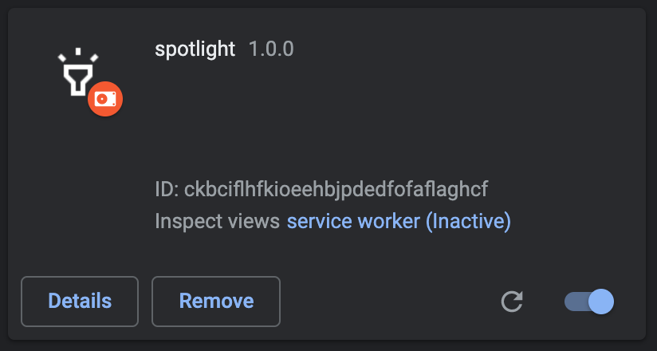

# 스포트라이트 크롬 익스텐션

## 설치

1. 레포를 다운로드합니다:

```bash
git clone https://github.com/datalater/spotlight.git
```
  
2. 크롬을 열고 URL에 다음 주소를 입력합니다: `chrome://extensions`
3. 오른쪽 상단에서 토글 스위치를 눌러 **개발자 모드**를 활성화 합니다.
4. `Load unpacked` 버튼을 누르고 확장 프로그램에 있는 디렉토리를 선택합니다.




## See also

- [Chrome Developers - Getting started](https://developer.chrome.com/docs/extensions/mv3/getstarted/)


